<p>
  
</p>

# 25+ Python Bokeh Examples

Python Bokeh is one of the best Python packages for data visualization. Today we are going to see some Python Bokeh Examples. Learn this easy visualization tool and add it to your Python stack.

## What is Python Bokeh?
Python [Bokeh](https://bokeh.org/) is a data visualization tool or we can also say Python Bokeh is used to plot various types of graphs. There are various other graph plotting libraries like matplotlib but Python Bokeh graphs are dynamic in nature means you can interact with the generated graph. See the below examples…

## Installation 💻:
Python Bokeh can be easily installed using PIP. You can install the Python Bokeh easily by running the command:
```bash
pip install bokeh
```

Now everything is ready let’s go through the examples 🏃♂️…

## 1. Line Plot

```python
from bokeh.plotting import figure, output_file, save
x = [1, 2, 3, 4, 5]
y = [4, 5, 5, 7, 3]
p = figure(title="Line Plot Python Bokeh Example", x_axis_label='X', y_axis_label='Y')
p.line(x, y, line_width=2)
output_file('1_line_plot.html')
save(p)
```

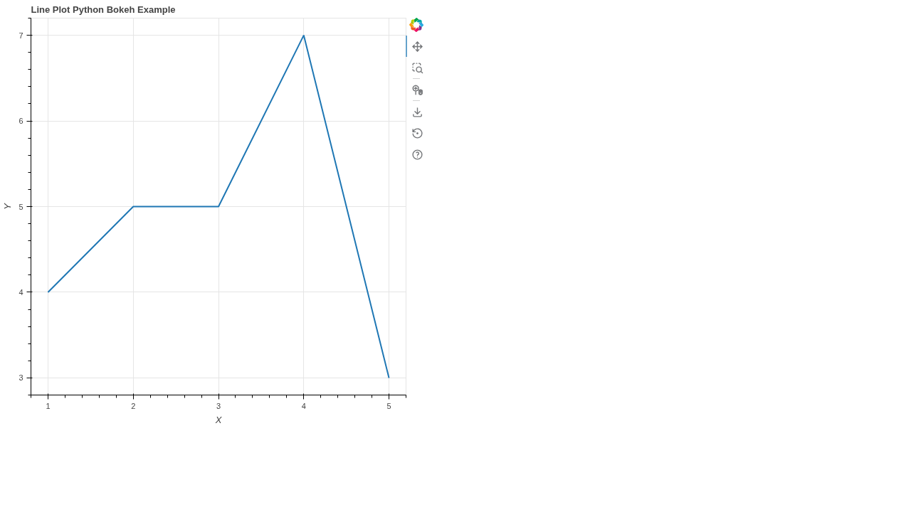

## 2. Scatter Plot

```python
from bokeh.plotting import figure, output_file, save
x = [1, 2, 3, 4, 5]
y = [4, 5, 5, 7, 3]
p = figure(title="Scatter Plot Example", x_axis_label='X', y_axis_label='Y')
p.scatter(x, y, size=15, color="navy", alpha=0.5)
output_file('2_scatter_plot.html')
save(p)
```

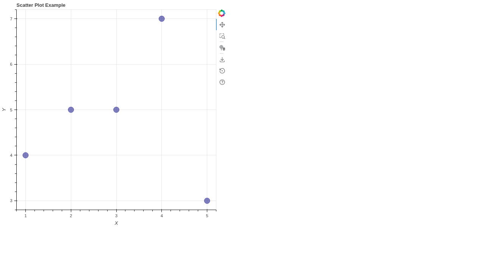

## 3. Bar Chart

```python
from bokeh.plotting import figure, output_file, save
fruits = ['Apples', 'Pears', 'Nectarines', 'Plums', 'Grapes', 'Strawberries']
counts = [5, 3, 4, 2, 4, 6]
p = figure(x_range=fruits, height=350, title="Fruit Counts", toolbar_location=None, tools="")
p.vbar(x=fruits, top=counts, width=0.9)
p.xgrid.grid_line_color = None
p.y_range.start = 0
output_file('3_bar_chart.html')
save(p)
```

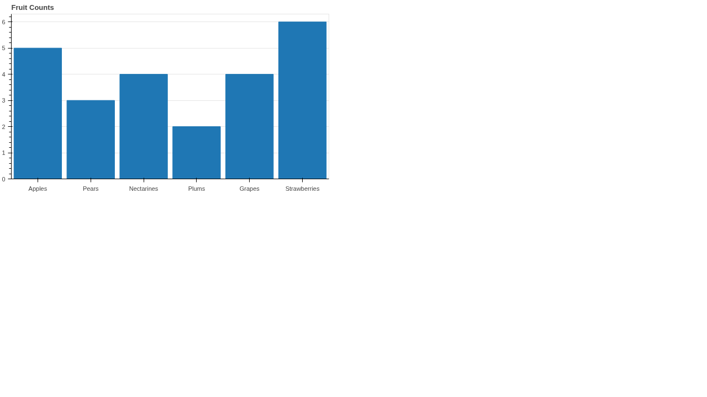

## 4. Pie Chart

```python
from bokeh.plotting import figure, output_file, save
from math import pi
import pandas as pd
from bokeh.transform import cumsum
x = { 'United States': 157, 'United Kingdom': 93, 'Japan': 89, 'China': 63, 'Germany': 44, 'India': 114 }
data = pd.Series(x).reset_index(name='value').rename(columns={'index':'country'})
data['angle'] = data['value']/data['value'].sum() * 2*pi
data['color'] = ['#3182bd', '#6baed6', '#9ecae1', '#c6dbef', '#e6550d', '#fd8d3c']
p = figure(height=350, title="Pie Chart", toolbar_location=None, tools="hover", tooltips="@country: @value", x_range=(-0.5, 1.0))
p.wedge(x=0, y=1, radius=0.4, start_angle=cumsum('angle', include_zero=True), end_angle=cumsum('angle'), line_color="white", fill_color='color', legend_field='country', source=data)
output_file('4_pie_chart.html')
save(p)
```

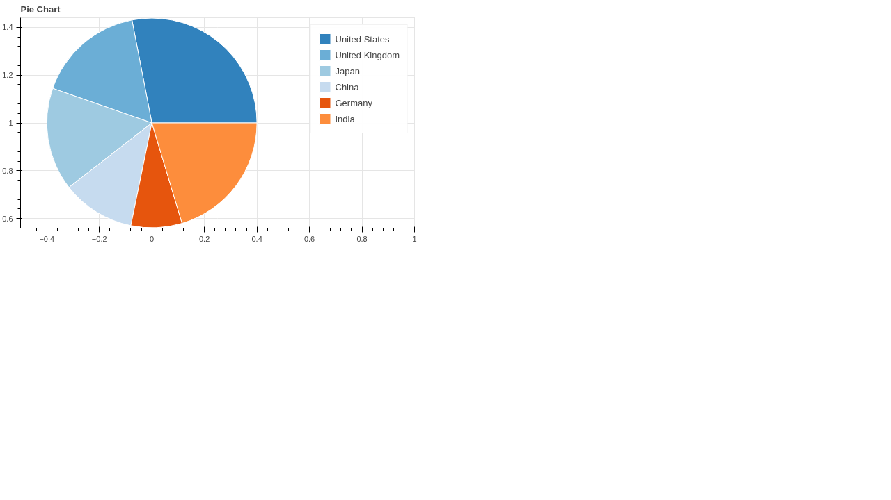

## 5. Step Chart

```python
from bokeh.plotting import figure, output_file, save
x = [1, 2, 3, 4, 5, 6]
y = [1, 4, 2, 5, 2, 6]
p = figure(title="Step Chart", x_axis_label='X', y_axis_label='Y')
p.step(x, y, line_width=2, mode="center")
output_file('5_step_chart.html')
save(p)
```

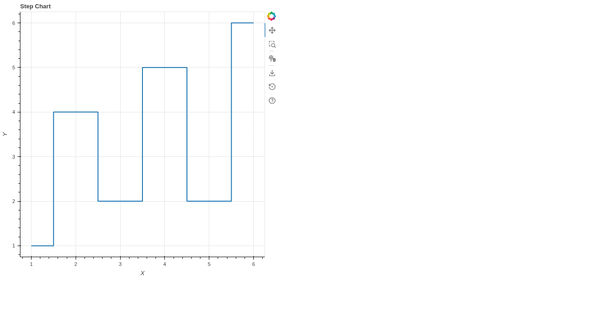

## 6. Area Chart

```python
from bokeh.plotting import figure, output_file, save
x = [1, 2, 3, 4, 5]
y1 = [2, 4, 5, 8, 4]
y2 = [1, 2, 4, 6, 3]
p = figure(title="Area Chart")
p.varea(x=x, y1=y1, y2=y2, fill_color="blue", alpha=0.3)
output_file('6_area_chart.html')
save(p)
```

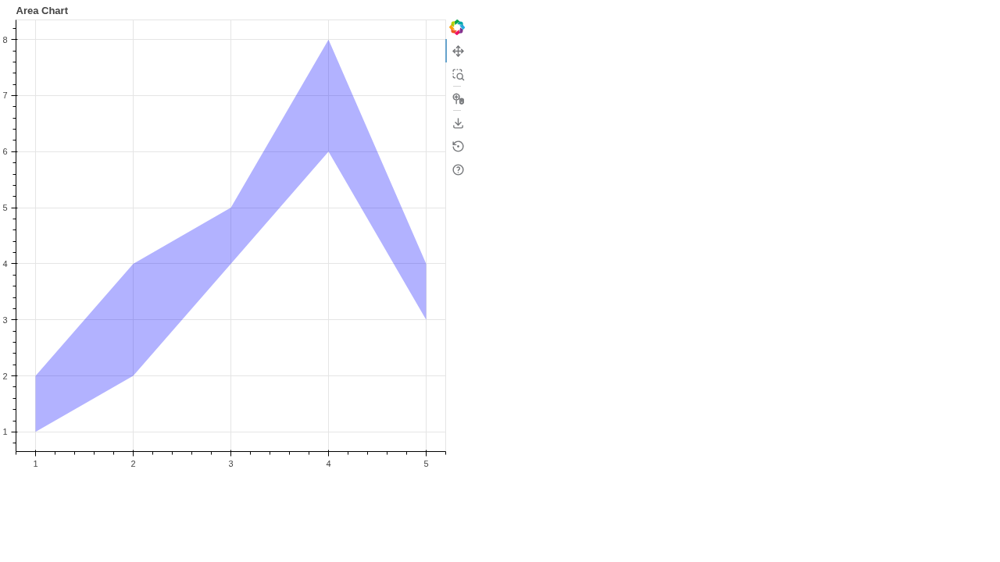

## 7. Histogram

```python
from bokeh.plotting import figure, output_file, save
import numpy as np
measured = np.random.normal(0, 0.5, 1000)
hist, edges = np.histogram(measured, density=True, bins=50)
p = figure(title="Histogram", background_fill_color="#fafafa")
p.quad(top=hist, bottom=0, left=edges[:-1], right=edges[1:], fill_color="navy", line_color="white", alpha=0.5)
output_file('7_histogram.html')
save(p)
```

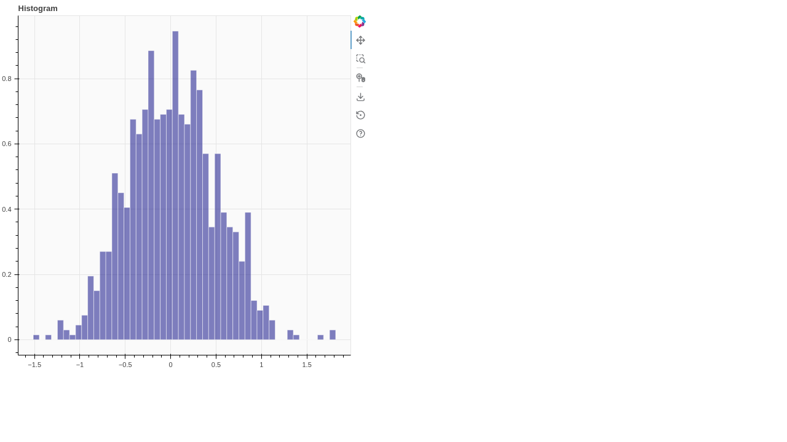

## 8. Multiple Lines

```python
from bokeh.plotting import figure, output_file, save
x = [1, 2, 3, 4, 5]
y1 = [6, 7, 2, 4, 5]
y2 = [5, 2, 8, 6, 2]
p = figure(title="Multiple Lines")
p.line(x, y1, legend_label="Temp", color="blue", line_width=2)
p.line(x, y2, legend_label="Rate", color="red", line_width=2)
output_file('8_multiple_lines.html')
save(p)
```

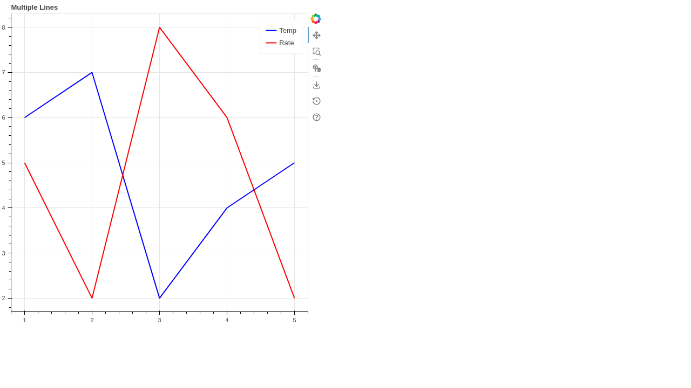

## 9. Horizontal Bar Chart

```python
from bokeh.plotting import figure, output_file, save
factors = ["a", "b", "c", "d", "e", "f", "g", "h"]
x = [50, 40, 65, 10, 25, 37, 80, 60]
p = figure(y_range=factors, title="Horizontal Bar Chart")
p.hbar(y=factors, right=x, height=0.5, color="green")
output_file('9_hbar_chart.html')
save(p)
```

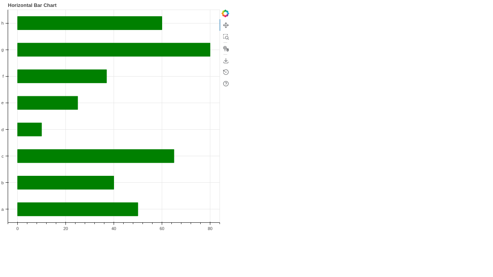

## 10. Hexbin Plot

```python
from bokeh.plotting import figure, output_file, save
import numpy as np
x = np.random.standard_normal(500)
y = np.random.standard_normal(500)
p = figure(title="Hexbin Plot", match_aspect=True, background_fill_color='#440154')
p.hexbin(x, y, size=0.5, hover_color="pink", hover_alpha=0.8)
output_file('10_hexbin_plot.html')
save(p)
```

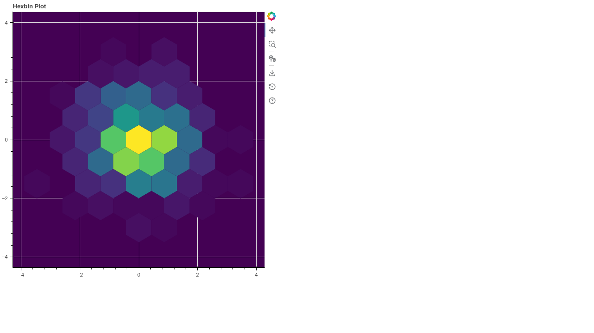

## 11. Patch Plot

```python
from bokeh.plotting import figure, output_file, save
x = [1, 2, 3, 4, 3, 2]
y = [2, 1, 1, 2, 3, 3]
p = figure(title="Patch Plot Example")
p.patch(x, y, alpha=0.5, line_width=2, fill_color="firebrick")
output_file('11_patch_plot.html')
save(p)
```

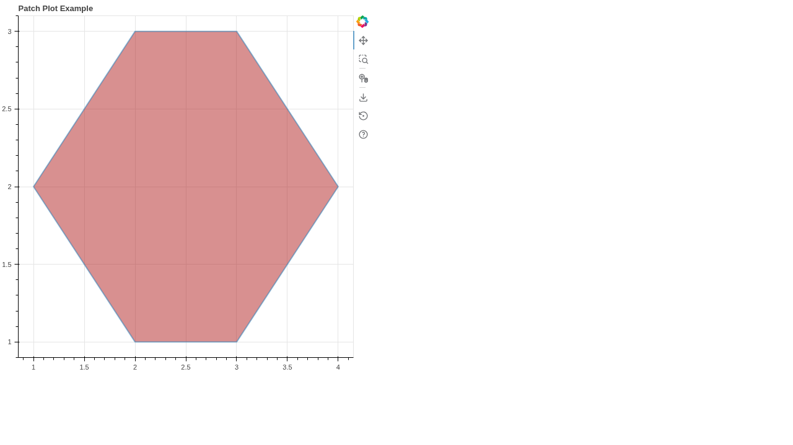

## 12. Stacked Bar Chart

```python
from bokeh.plotting import figure, output_file, save
fruits = ['Apples', 'Pears', 'Nectarines']
years = ["2015", "2016", "2017"]
colors = ["#c9d9d3", "#718dbf", "#e84d60"]
data = {'fruits': fruits, '2015': [2, 1, 4], '2016': [5, 3, 4], '2017': [3, 2, 4]}
p = figure(x_range=fruits, height=350, title="Fruit Counts by Year", toolbar_location=None, tools="")
p.vbar_stack(years, x='fruits', width=0.9, color=colors, source=data, legend_label=years)
output_file('12_stacked_bar.html')
save(p)
```

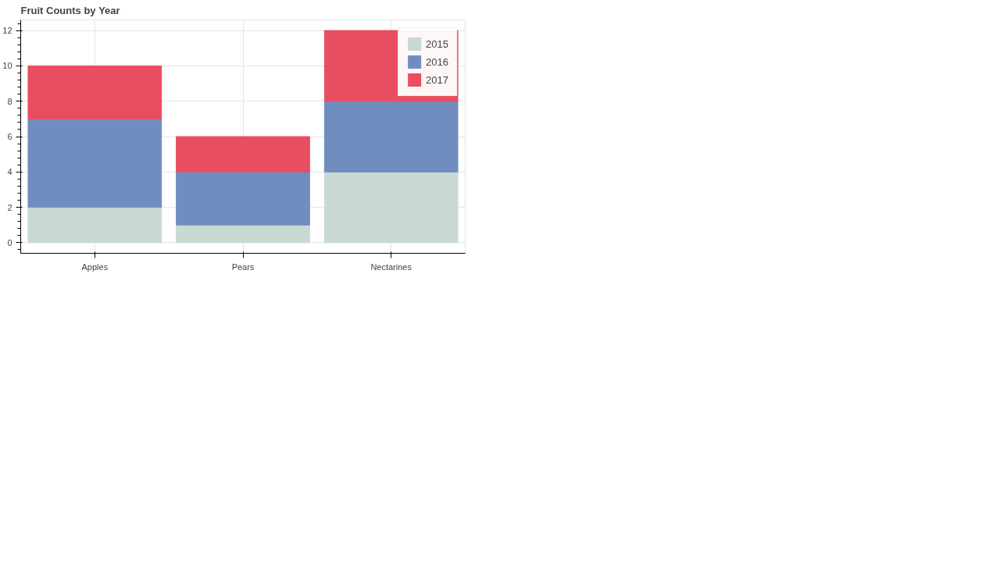

## 13. Annulus Plot

```python
from bokeh.plotting import figure, output_file, save
p = figure(title="Annulus Plot")
p.annulus(x=[1, 2, 3], y=[1, 2, 3], color="#7FC97F", inner_radius=0.1, outer_radius=0.25)
output_file('13_annulus.html')
save(p)
```

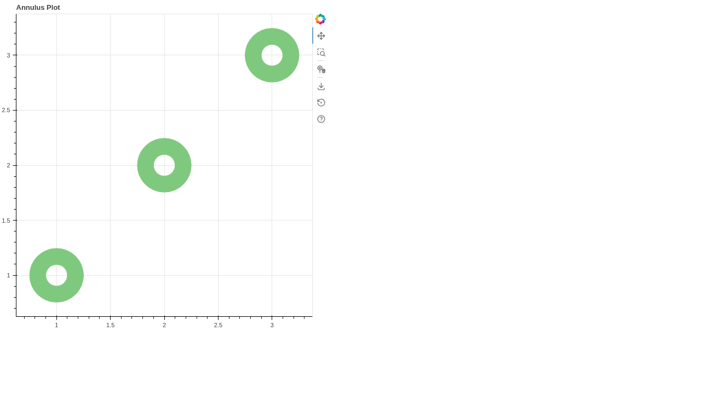

## 14. Wedge Plot

```python
from bokeh.plotting import figure, output_file, save
p = figure(title="Wedge Plot Example")
p.wedge(x=[1, 2, 3], y=[1, 2, 3], radius=0.2, start_angle=0.4, end_angle=4.8, color="firebrick", alpha=0.6, direction="clock")
output_file('14_wedge_plot.html')
save(p)
```

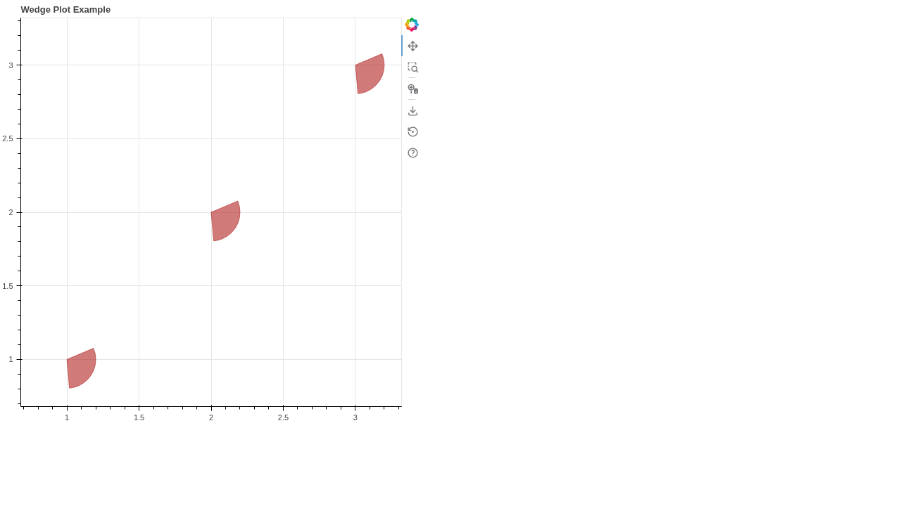

## 16. Segment Plot

```python
from bokeh.plotting import figure, output_file, save
p = figure(title="Segment Plot Example")
p.segment(x0=[1, 2, 3], y0=[1, 2, 3], x1=[1.2, 2.5, 3.7], y1=[1.5, 2.1, 3.9], color="#F4A582", line_width=3)
output_file('16_segment_plot.html')
save(p)
```

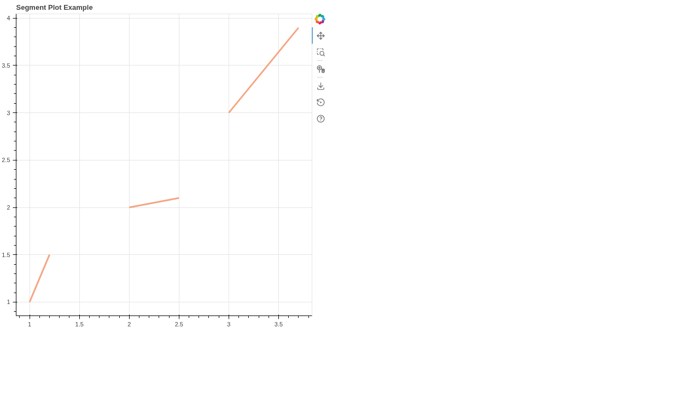

## 17. Ray Plot

```python
from bokeh.plotting import figure, output_file, save
p = figure(title="Ray Plot Example")
p.ray(x=[1, 2, 3], y=[1, 2, 3], length=45, angle=0.6, color="#1B9E77", line_width=2)
output_file('17_ray_plot.html')
save(p)
```

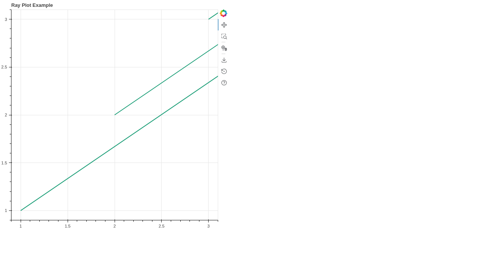

## 18. Multi-Line Plot

```python
from bokeh.plotting import figure, output_file, save
p = figure(title="Multi-Line Example")
p.multi_line(xs=[[1, 2, 3], [2, 3, 4]], ys=[[2, 1, 4], [4, 3, 5]], color=["firebrick", "navy"], line_width=2)
output_file('18_multi_line.html')
save(p)
```

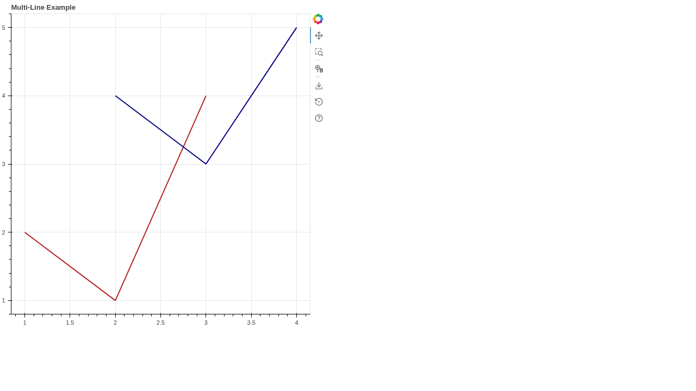

## 19. Multi-Polygon Plot

```python
from bokeh.plotting import figure, output_file, save
p = figure(title="Multi-Polygon Example")
p.multi_polygons(xs=[[[[1, 2, 2, 1]]]], ys=[[[[1, 1, 2, 2]]]], color="olive", alpha=0.5)
output_file('19_multi_polygon.html')
save(p)
```

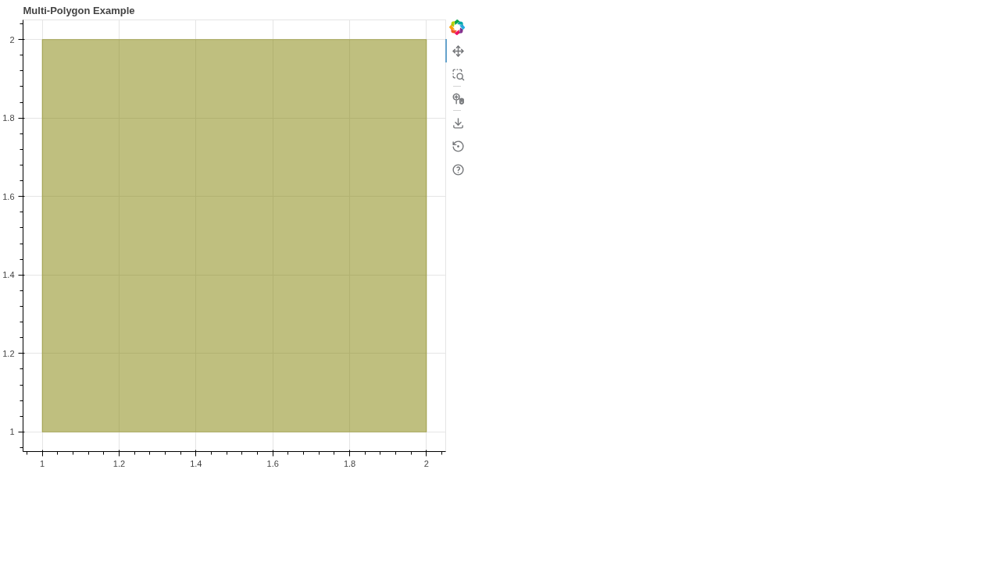

## 20. Text Annotation

```python
from bokeh.plotting import figure, output_file, save
p = figure(title="Text Annotation Example")
p.text(x=[1, 2, 3], y=[1, 2, 3], text=["A", "B", "C"], text_color="firebrick", text_font_size="20pt")
output_file('20_text_annotation.html')
save(p)
```

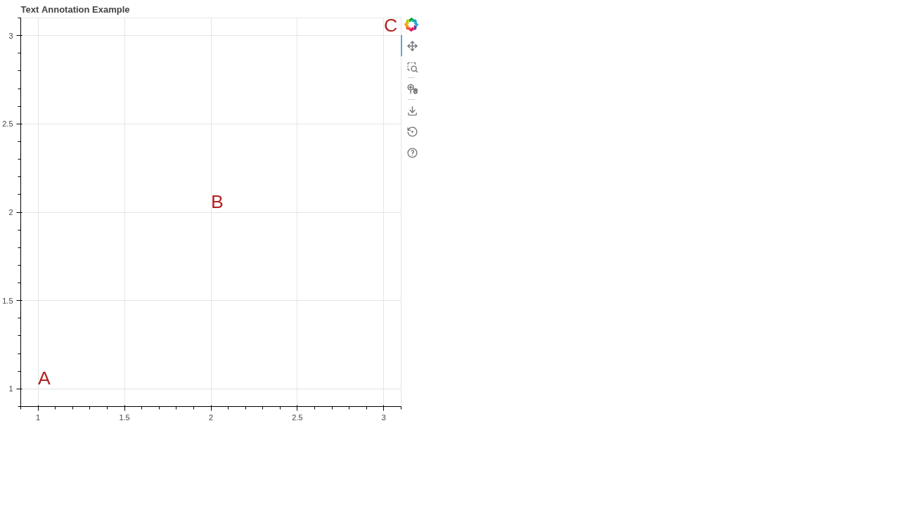

## 21. Gridplot

```python
from bokeh.plotting import figure, output_file, save
from bokeh.layouts import gridplot
x = list(range(11))
y0 = x
y1 = [10 - i for i in x]
p1 = figure(width=250, height=250, title="Plot 1")
p1.scatter(x, y0, size=10, color="firebrick")
p2 = figure(width=250, height=250, title="Plot 2")
p2.line(x, y1, line_width=3, color="navy")
p = gridplot([[p1, p2]])
output_file('21_gridplot.html')
save(p)
```

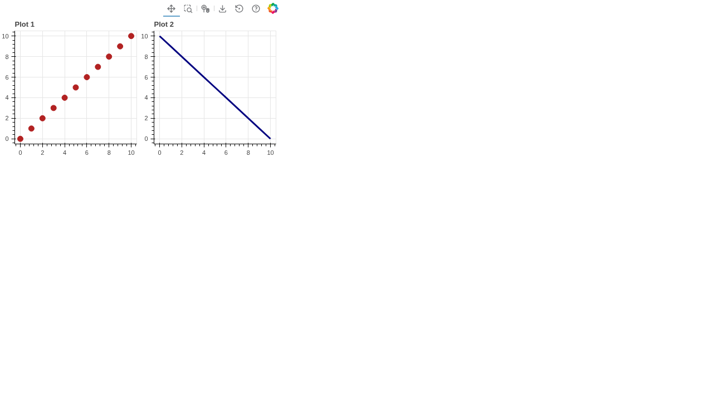

## 22. Categorical Heatmap

```python
from bokeh.plotting import figure, output_file, save
factors = ["a", "b", "c", "d"]
x = ["a", "b", "c", "d"]
y = ["a", "b", "c", "d"]
p = figure(title="Categorical Heatmap", x_range=factors, y_range=factors)
p.rect(x=x, y=y, width=1, height=1, color="#718dbf", alpha=0.5)
output_file('22_categorical_heatmap.html')
save(p)
```

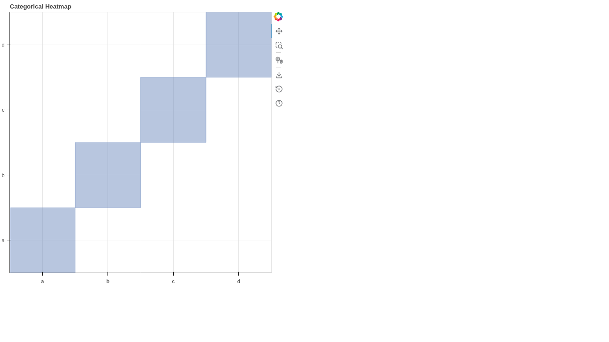

## 23. Log Axis Plot

```python
from bokeh.plotting import figure, output_file, save
x = [0.1, 0.5, 1.0, 1.5, 2.0, 2.5, 3.0]
y = [10**i for i in x]
p = figure(title="Logarithmic Axis Example", y_axis_type="log")
p.line(x, y, line_width=2)
p.scatter(x, y, fill_color="white", size=8)
output_file('23_log_axis.html')
save(p)
```

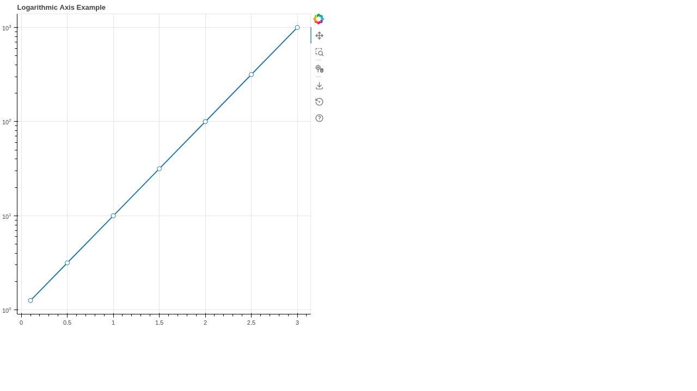

## 24. Range Tool Plot

```python
from bokeh.plotting import figure, output_file, save
from bokeh.models import Range1d
p = figure(title="Custom Range Plot", x_range=Range1d(0, 10), y_range=Range1d(0, 20))
p.scatter([1, 5, 9], [2, 10, 18], size=10, color="navy")
output_file('24_range_tool.html')
save(p)
```

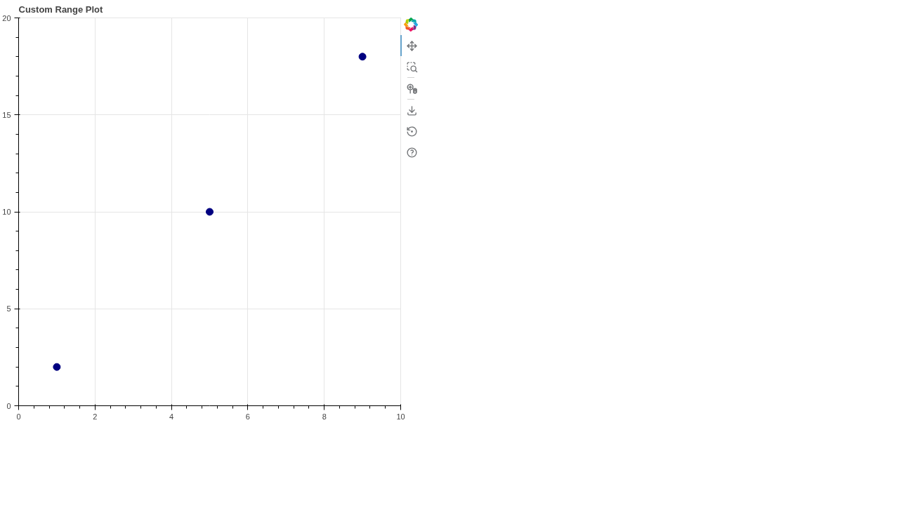

## 25. VBar Plot

```python
from bokeh.plotting import figure, output_file, save
p = figure(title="VBar Example")
p.vbar(x=[1, 2, 3], width=0.5, bottom=0, top=[1.2, 2.5, 3.7], color="firebrick")
output_file('25_vbar_plot.html')
save(p)
```

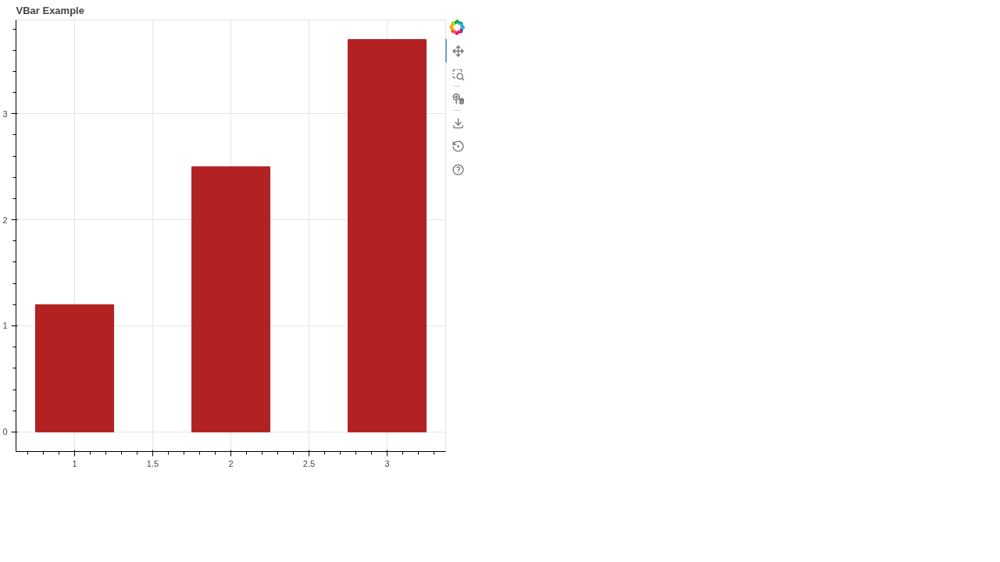

## 26. HBar Plot

```python
from bokeh.plotting import figure, output_file, save
p = figure(title="HBar Example")
p.hbar(y=[1, 2, 3], height=0.5, left=0, right=[1.2, 2.5, 3.7], color="navy")
output_file('26_hbar_plot.html')
save(p)
```

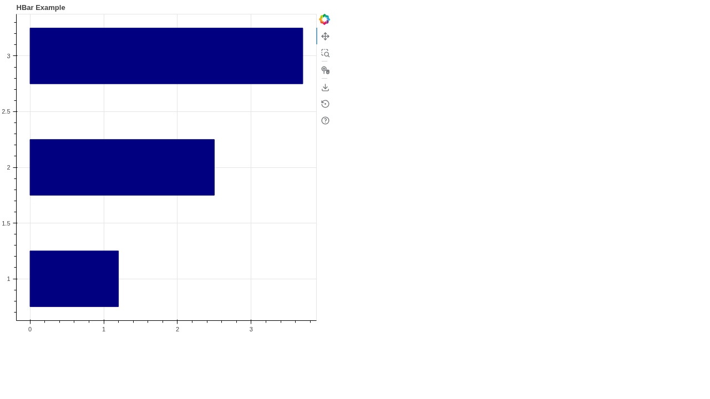

